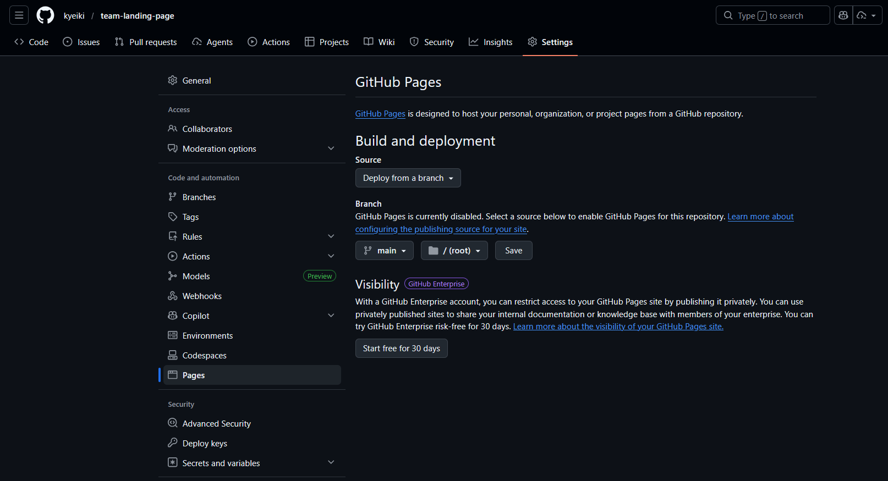
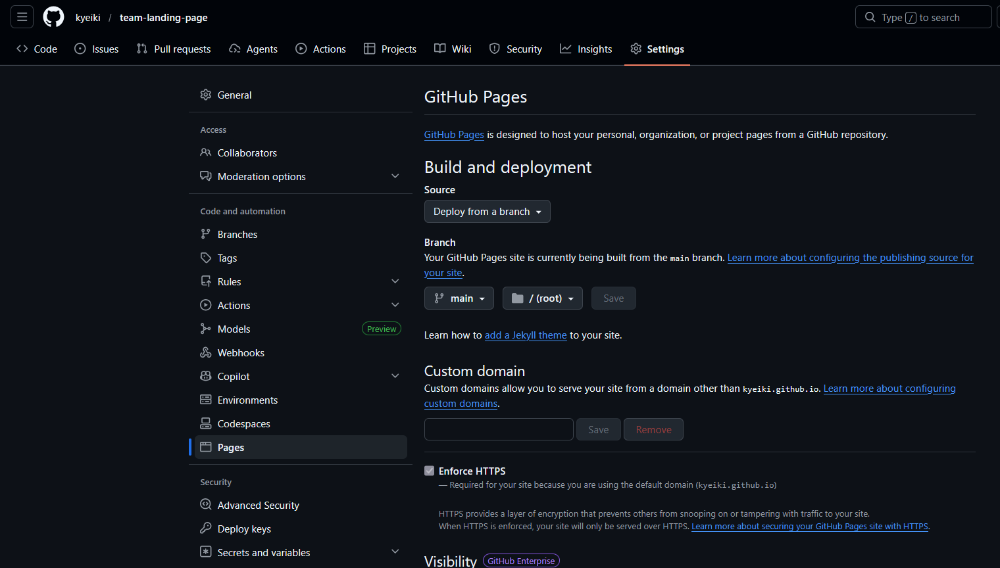
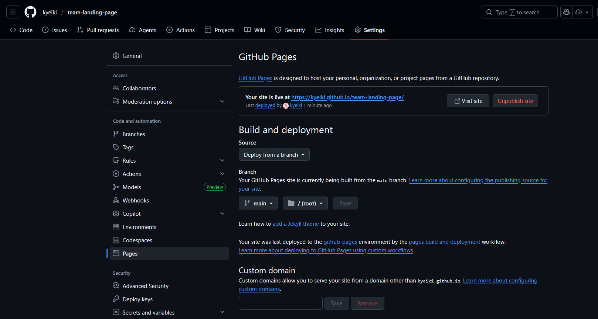

# 🚀 Panduan Deploy ke GitHub Pages

Panduan lengkap untuk deploy landing page ke GitHub Pages.

---

## 📋 Persiapan

> ⚠️ **Catatan**: Jika kamu sudah pernah melakukan setup Git di project lain (install Git + config user), langsung skip ke bagian **Setup Repository**.

### 1. Install Git
Download & install dari: https://git-scm.com/download/win

Setelah install, buka **Command Prompt** atau **PowerShell**, cek:
```bash
git --version
```

### 2. Buat Akun GitHub
Jika belum punya, daftar di: https://github.com/signup

---

## 🔧 Setup Repository

### Step 1: Buka Terminal di Folder Project
```powershell
cd F:\PROYEK1
```

### Step 2: Inisialisasi Git
```bash
git init
```

### Step 3: Konfigurasi Git (Pertama Kali)
```bash
git config --global user.name "Nama Kamu"
git config --global user.email "email@kamu.com"
```

### Step 4: Tambahkan Semua File
```bash
git add .
```

### Step 5: Commit Pertama
```bash
git commit -m "Initial commit: Team landing page"
```

---

## 🌐 Upload ke GitHub

### Step 1: Buat Repository Baru di GitHub
1. Buka https://github.com/new
2. **Repository name**: `team-landing-page` (atau nama lain)
3. **Public** (wajib untuk GitHub Pages gratis)
4. ❌ JANGAN centang "Add a README file"
5. Klik **Create repository**

### Step 2: Hubungkan & Push
Setelah repo dibuat, jalankan (ganti `USERNAME` dengan username GitHub kamu):
```bash
git remote add origin https://github.com/USERNAME/team-landing-page.git
git branch -M main
git push -u origin main
```

> 💡 **Login Prompt**: Jika diminta login, masukkan username & password GitHub (atau Personal Access Token).

---

## ⚙️ Aktifkan GitHub Pages

1. Buka repository di GitHub
2. Klik **Settings** (tab atas)
3. Scroll ke **Pages** (sidebar kiri)

**Tampilan awal sebelum konfigurasi:**



4. Di bagian **Source**:
   - Branch: `main`
   - Folder: `/ (root)`
5. Klik **Save**

**Tampilan saat proses build:**



6. Tunggu 1-2 menit hingga proses build selesai

### 🎉 Website Live!

**Tampilan setelah website live:**



✅ Sekarang website kamu sudah bisa diakses!

URL kamu: `https://USERNAME.github.io/team-landing-page/`

---

## 🔄 Update Website (Setelah Edit)

Setiap kali ada perubahan:
```bash
git add .
git commit -m "Update: deskripsi perubahan"
git push
```

Contoh:
```bash
git add .
git commit -m "Update: ganti foto profil team"
git push
```

---

## ❓ Troubleshooting

| Masalah | Solusi |
|---------|--------|
| `git` tidak dikenali | Install Git, restart terminal |
| Push ditolak | Cek username/password, gunakan Personal Access Token |
| Website tidak muncul | Tunggu 2-5 menit, cek Settings > Pages |
| Gambar tidak muncul | Pastikan nama file SAMA PERSIS (case-sensitive) |

---

## 📁 Struktur File yang Diupload

```
team-landing-page/
├── index.html                               ← Halaman utama
├── styles.css                               ← Styling
├── script.js                                ← JavaScript
├── imagefoto.png                            ← Foto profil team
├── tampilan-github-pages.png                ← Screenshot panduan
├── tampilan-github-pages-sedang-dibuilt.png ← Screenshot panduan
├── tampilan-github-pages-sudah-live.png     ← Screenshot panduan
└── DEPLOY_GUIDE.md                          ← Panduan ini
```

---

**Made with 💜 | 2025**
